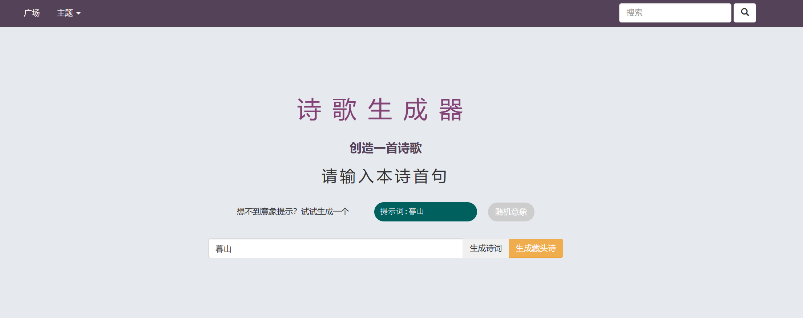
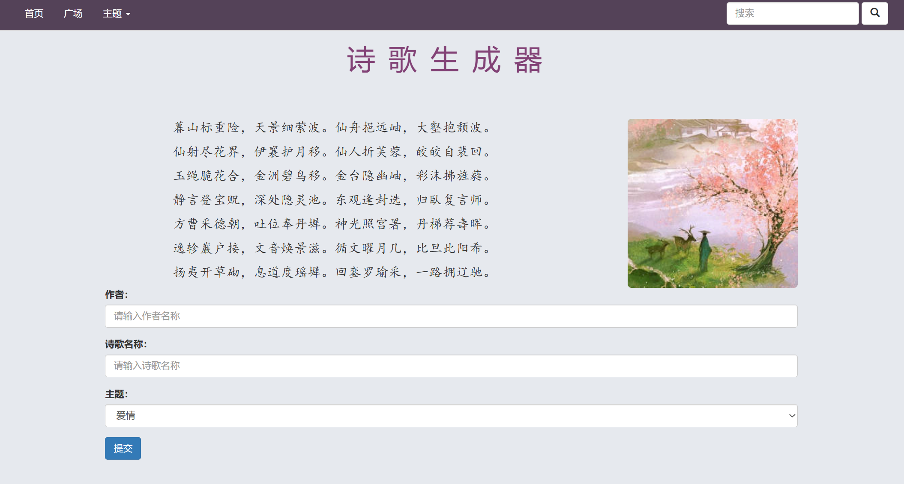
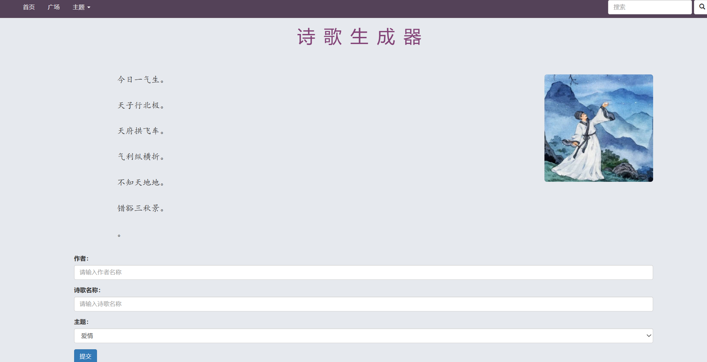

# Flask+LSTM实现AI写诗

### 前言
基于flask+LSTM实现AI写诗。支持根据提示词续写全诗和藏头诗。
该项目参考了《pytorch入门与实践》的教程。

### 运行效果
#### 1、首句生成
根据提示词输入，生成诗句。提示词是基于训练数据分词后的结果，所以可能会出现提示词不在训练数据中无法生成的情况。

生成诗句后填写作者和诗名，点击保存即可保存到数据库中。

界面点击广场可以查看其他用户生成的诗句。


### 2、藏头诗
eg:输入"今天天气不错"，生成的诗句为：

今日一气生。    
天子行北极。    
天府拱飞车。   
气利纵横折。  
不知天地地。  
错豁三秋景。
### 前期准备

- core i7 的笔记本
- 一个 GTX 1080ti 的显卡
- 装上pytorch的cpu和GPU版本


### 数据集

整理好的numpy格式数据集，

http://pytorch-1252820389.cosbj.myqcloud.com/tang_199.pth

其中包含唐诗57580首*125字，不足和多余125字的都被补充或者截断。


### 实现细节

1. data是numpy数组，57580首*125字
2. word2ix和ix2word都是字典类型，用于字符和序号的映射
3. nn.Embedding层可以输入为long Tensor型的字的下标（int），输入为同样shape的词向量，下标换成了向量，其余形状不变。最重要的构造参数是num_embeddings, embedding_dim
4. nn.LSTM主要构造参数input_size,hidden_size和num_layers，其中input_size其实就是词向量的维度，forward时输入为input和（h0,c0）,其中input为(seq_len,batch_size,input_size)，h0和c0是(num_layers $*$ num_directions, batch, hidden_size)，而forward的输出为output和(hn,cn)，一般后面一个就叫做hidden，output为(seq_len, batch, num_directions $*$ hidden_size)
5. 在本网络中，从前往后总共经历了这么几个网络，其向量变化如下：
    - input:(seq_len,batch_size)
    - 经过embedding层，embeddings(input)
    - embeds:(seq_len,batch_size,embedding_size)
    - 经过LSTM，lstm(embeds, (h_0, c_0))，输出output，hidden
    - output：(seq_len, batch, num_directions $*$ hidden_size)
    - output view为(seq_len $*$ batch, num_directions $*$ hidden_size)
    - 进过Linear层判别
    - output：(seq_len $*$ batch, vocab_size)
6. 具体训练时的实现方法：
    - 输入的input为(batch_size,seq_len)
    - data_ = data_.long().transpose(1,0).contiguous()将数据转置并且复制了一份，成了(seq_len,batch_size)
    - 通过input_,target = data_[:-1,:],data_[1:,:]将每句话分为前n-1个字作为真正的输入，后n-1个字作为label，size都是(seq_len-1,batch_size)
    - 经过网络，得出output：((seq_len-1) $*$ batch, vocab_size)
    - 通过target.view(-1)将target变成((seq_len-1) $*$ batch)
    - 这里的target不需要是一个one-hot向量，因crossEntropy不需要，直接是下标即可
    - 然后反向传播即可
7. 生成诗句的方法：
    - 首字为<START>，首个hidden自动为空
    - 如果有前缀风格，通过前缀生成hidden
    - 在首句内部时，不使用output，仅仅不断前进得到hidden，直到首句结尾。
    - 进入生成模式后，实际上每次调用model都生成一个字，逐渐生成前n句话。
    - 藏头诗同理，只是在头的部分将诗句首字换掉

   
### 使用方法
首先训练模型，然后运行app.py，访问。当然也可以直接执行app.py，使用预训练内容。
```python
python main.py
```
```python
python app.py
```
